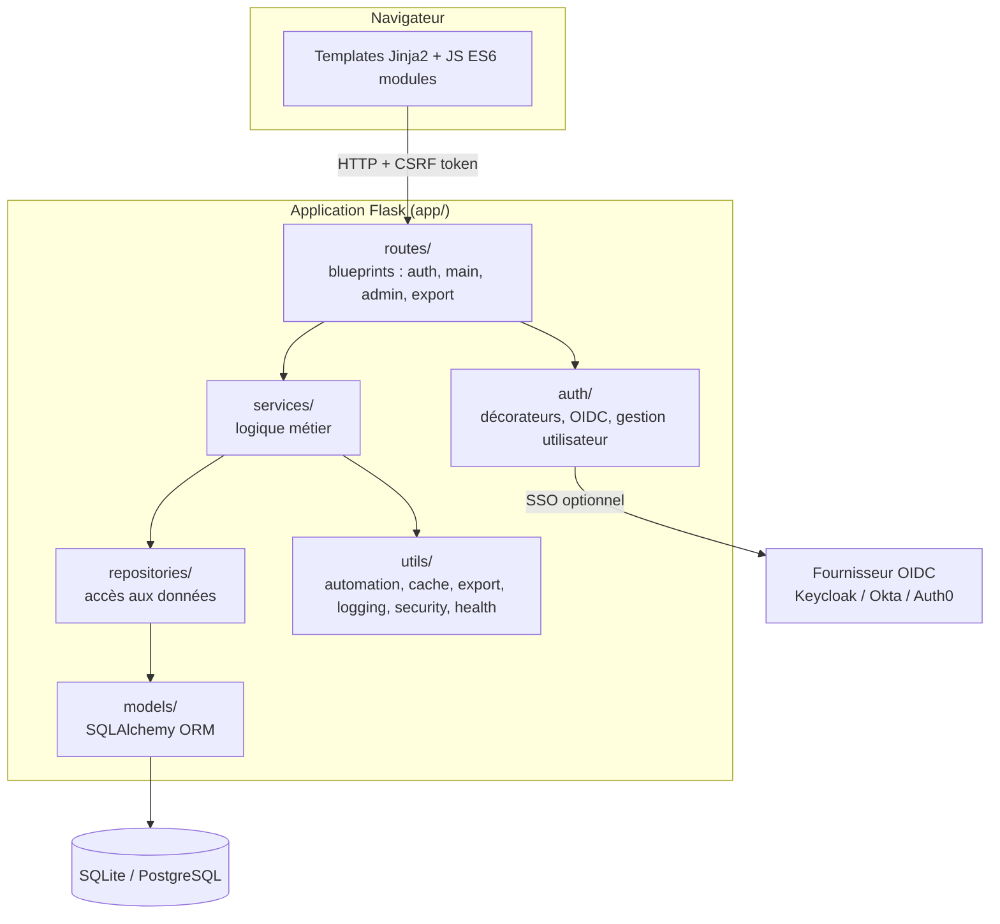
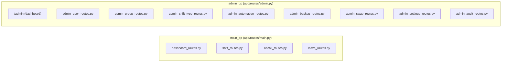

# Architecture technique

> Réécrit intégralement en Phase 5 (2026-07) — la version précédente
> décrivait `app/models.py` en fichier plat et `app/utils/decorators.py`/
> `helpers.py`/`ics_exporter.py`/`automation.py` directement à la racine
> de `app/utils/` ; ces deux structures ont été remplacées par des
> packages depuis les Phases 2-4 (voir `report/Phase 2: Backend.md` et
> `CLAUDE.md` à la racine du dépôt pour l'historique).

## Vue d'ensemble

Leviia Schedule est une application Flask monolithique en couches :
routes → services → repositories → modèles, avec les gabarits Jinja2
rendus côté serveur (pas de frontend séparé/SPA).



### Pourquoi une couche services/repositories

Avant la Phase 2, toute la logique (parsing de requête, règles métier,
requêtes SQL) vivait directement dans `app/main.py` (1287 lignes) et
`app/admin.py`. Ça a été scindé en trois responsabilités distinctes :

- **`app/routes/`** : parse la requête HTTP, appelle un service, transforme
  le résultat en flash/redirect/JSON. Aucune requête SQL ni règle métier
  ici.
- **`app/services/`** : logique métier (validations comme `can_add_shift`,
  effets de bord comme le rééquilibrage automatique des shifts après un
  changement de congé). Appelle les repositories, jamais Flask
  directement (pas de `request`/`flash`/`render_template`).
- **`app/repositories/`** : accès aux données, requêtes SQLAlchemy pures.
  Aucune logique métier ici (pas de `can_add_*`, pas de calcul de dates).

Chaque blueprint (`main`, `admin`) est en réalité découpé sur plusieurs
fichiers Python qui s'enregistrent tous sur le **même objet
`Blueprint`** (défini dans `main.py`/`admin.py`), pour éviter de casser
les références `url_for()` existantes :



## Structure des dossiers

```
app/
├── __init__.py           # create_app() : factory, extensions (db, login_manager,
│                          # limiter, csrf, Talisman conditionnel), blueprints
├── config/                # Configuration active : base.py, development.py,
│                          # production.py, testing.py
├── auth/                  # decorators.py (garde-fous de route), user_manager.py,
│                          # oidc_auth.py (SSO via Authlib)
├── models/                 # BaseModel + Group, User, ShiftType, Shift, OnCall,
│                          # Leave, AutomationConfig, NotificationLog, Setting,
│                          # SwapRequest, AppNotification, AuditLog
├── repositories/           # UserRepository, GroupRepository, ShiftRepository,
│                          # ShiftTypeRepository, OnCallRepository, LeaveRepository,
│                          # SwapRequestRepository, AppNotificationRepository,
│                          # AuditLogRepository (pas de repository dédié pour
│                          # Setting - Setting.get()/set() sont des méthodes du
│                          # modèle lui-même)
├── services/               # UserService, GroupService, ShiftService,
│                          # ShiftTypeService, OnCallService, LeaveService,
│                          # ExportService, ScheduleService, AutomationAdminService,
│                          # SwapService, SettingsService (réglages admin
│                          # DB-backed avec repli env, voir ERD.md), AuditService
│                          # (point d'écriture unique de l'audit trail),
│                          # NotificationService (rappels email, appelé par
│                          # scripts/send_*_notifications.py, pas par une route),
│                          # AppNotificationService (cloche in-app, appelé par
│                          # SwapService sur les événements d'échange),
│                          # BackupService (wrappe scripts/backup_database.py
│                          # pour /admin/backups)
├── routes/                 # auth.py, main.py + {dashboard,shift,oncall,leave,
│                          # swap,notification}_routes.py, admin.py +
│                          # admin_{user,group,shift_type,automation,backup,
│                          # swap,settings,audit}_routes.py, export.py
├── utils/
│   ├── automation/         # AdvancedShiftAutomation (moteur unique de génération
│   │                      # de shifts), OnCallAutomation, status
│   ├── export/              # génération ICS (icalendar), zoneinfo (pas pytz)
│   ├── helpers/             # common_helpers.py (can_add_shift/leave/oncall,
│   │                      # formatage/parsing de dates, filtres Jinja
│   │                      # format_date/format_time/format_datetime),
│   │                      # timezone_helpers.py, js_translations.py
│   ├── logging/             # logger multi-handler : app.log, error.log,
│   │                      # debug.log, http_errors.log, audit.log (tous en
│   │                      # RotatingFileHandler) - pas de sql.log/auth.log/
│   │                      # syslog, contrairement à une ancienne version de
│   │                      # cette doc. audit.log est alimenté par
│   │                      # AuditService.log() (voir CLAUDE.md "Audit trail")
│   ├── notifications/       # email_sender.py (smtplib/email, stdlib) - appelé
│   │                      # par NotificationService, pas de route associée
│   ├── optimizations/       # eager_load (seul décorateur restant, Phase 4)
│   ├── security/            # (vide depuis Phase 4 — encryption.py et
│   │                      # token_manager.py supprimés, aucun appelant réel)
│   ├── health.py            # endpoints /health, /ready, /version (k8s probes)
│   └── prometheus_metrics.py # /metrics, gated par PROMETHEUS_ENABLED
├── static/
│   ├── css/                 # variables/base/utilities/components/layout/themes/pages
│   │                      # (Tailwind CSS 4 + daisyUI 5 via CDN, pas de build - voir
│   │                      # ci-dessous ; ces fichiers ne font qu'augmenter les
│   │                      # composants daisyUI, plus de vendoring local)
│   └── js/                  # main.js (entrée module ES6) + theme/utils/notifications
└── templates/                # Jinja2, macros/errors.html pour les pages d'erreur,
                              # emails/ pour les gabarits de notification (HTML + texte)
```

**Frontend** — Tailwind CSS 4 + daisyUI 5, chargés via `cdnjs.cloudflare.com`, zéro étape de
build (Tailwind tourne en `tailwindcss-browser`, le compilateur JIT officiel qui scanne les
classes directement dans le navigateur - pas de `package.json`/npm dans ce projet, choix
délibéré). Bulma entièrement retiré (PR #108, refonte Tailwind/daisyUI) : plus de dossier
vendor ni de script de téléchargement, Font Awesome (7.2.0, mode SVG+JS - les `.woff2` de
cdnjs pour cette version sont corrompus, rejetés par le sanitizer de police de Chromium) et
FullCalendar (resté en 6.1.21, chargé depuis `cdn.jsdelivr.net` - seule exception à "tout via
cdnjs", cdnjs n'hébergeant pas ses fichiers de locale ; la version 7.0.0 a été testée via trois
CDN différents et lève systématiquement une erreur d'exécution réelle dans le rendu Preact
compilé de FullCalendar lui-même, pas un problème d'hébergement) sont eux aussi 100% CDN.
`app/static/css/variables.css` fait le pont entre les variables `--color-*` de daisyUI et des
noms d'application stables (`--app-color-primary`, `--bg-primary`...) utilisés par le peu de CSS
maison restant.

**Identité visuelle** (PR #110) : palette officielle Dracula (thème sombre) / Alucard (thème
clair), surchargée dans `app/static/css/theme-colors.css` sur chaque couleur sémantique daisyUI
(`--color-primary/-secondary/-accent/-neutral/-info/-success/-warning/-error` et les trois niveaux
de surface `base-100/200/300`) - valeurs 100% issues de draculatheme.com/spec, aucune teinte
inventée. Seule méthode possible sous `tailwindcss-browser` (le compilateur JIT ne supporte pas
`@plugin "daisyui/theme"`/`@theme`, vérifié en navigateur réel). Navigation mobile en `drawer`
daisyUI natif, modale de création de shift (générée en JS dans `fullcalendar-config.js`) en
`<dialog>` natif plutôt qu'un toggle de classe `.modal-open`.

`scripts/` (hors `app/`) contient les points d'entrée cron autonomes -
`send_shift_notifications.py`/`send_oncall_notifications.py` +
`notification_config.py` (config SMTP via variables d'environnement) -
suivant le même pattern que `backup_database.py`/`backup_config.py`
(sauvegarde locale/S3, indépendant de `app/` par conception - reprise
après sinistre). Pas de scheduler intégré à l'application Flask (pas
d'APScheduler) : ces scripts sont déclenchés par une tâche cron externe
(voir `scripts/cron_example.sh`), ou, en Docker, par `crond` démarré par
`docker/entrypoint.sh` dans le même conteneur (`NOTIFICATIONS_ENABLED`/
`BACKUP_ENABLED`, planning dans `docker/crontabs/appuser`).
`BackupService` (`app/services/`) est la seule exception au sens
inverse - il importe `scripts/backup_config.py`/`backup_database.py`
pour l'interface d'administration, sans casser l'isolation puisque
`scripts/` n'importe jamais `app/`.

## Modèles de données

Voir [`ERD.md`](ERD.md) pour le schéma entité-relation complet.

Résumé : `Group` 1:N `User` 1:N `Shift`/`OnCall`/`Leave` (chacun 1:N
depuis `User`), `ShiftType` 1:N `Shift`. `AutomationConfig` est une table
autonome (clé/valeur JSON) sans relation, utilisée pour persister l'ordre
de rotation des astreintes. `NotificationLog` (user_id, notification_type,
period_start, contrainte unique sur les trois) enregistre les rappels
email déjà envoyés, pour empêcher un double envoi si un script cron est
relancé sur la même période. `Setting` est le même genre de store
clé/valeur qu'`AutomationConfig`, mais pour les réglages admin éditables
à chaud (`/admin/settings`). `SwapRequest` porte 3 FK vers `User`
(requester/target_user/reviewer) et 2 vers `Shift` (shift/target_shift).
`AppNotification` (cloche in-app) et `AuditLog` (historique des
modifications, `/admin/audit-log`) sont tous deux 1:N depuis `User` mais
ne doivent pas être confondus entre eux ni avec `NotificationLog` — voir
CLAUDE.md ("In-app notifications", "Audit trail") pour la distinction.

## Authentification

Deux modes, contrôlés par `OIDCConfig` (`config_oidc.py`) :

1. **Basique** (par défaut) : email/mot de passe via Flask-Login,
   formulaire `/login`.
2. **OIDC/SSO** (optionnel) : si `OIDC_ENABLED=true`, redirection vers le
   fournisseur configuré. Si en plus `OIDC_DISABLE_BASIC_AUTH=true`, le
   formulaire classique est désactivé et `/login` redirige directement
   vers `/oidc/login`.

Voir [`SEQUENCE_DIAGRAMS.md`](SEQUENCE_DIAGRAMS.md) pour le détail des
deux flux.

## Sécurité

- **CSRF** : `Flask-WTF` `CSRFProtect` actif sur toute l'application
  (ajouté en Phase 4 — absent auparavant malgré la présence de la
  dépendance). Les formulaires HTML embarquent un champ caché
  `csrf_token`, les appels `fetch()` JS envoient l'en-tête
  `X-CSRFToken` (lu depuis une balise `<meta name="csrf-token">` dans
  `base.html`).
- **Talisman** : en-têtes de sécurité HTTP (X-Content-Type-Options,
  X-Frame-Options, etc.), activé seulement si `TALISMAN_FORCE_HTTPS=true`
  (voir `app/config/`).
- **Mots de passe** : hashés via Werkzeug (`generate_password_hash`),
  jamais stockés en clair, jamais sérialisés (`User.to_dict()` exclut
  explicitement `password_hash` et `ics_token`).
- **Export ICS** : accessible soit via une session authentifiée, soit via
  un token porteur (`ics_token`, `secrets.token_urlsafe(32)`) passé en
  paramètre d'URL — voir [`api/API.md`](../api/API.md).

## Base de données

SQLite par défaut (fichier `instance/app.db`), PostgreSQL supporté en
production (voir [`deployment/DEPLOYMENT_ADVANCED.md`](../deployment/DEPLOYMENT_ADVANCED.md)).
Index composites présents sur `Shift(user_id, date)`,
`Shift(date, start_time)`, `OnCall(user_id, start_time, end_time)`,
`Leave(user_id, start_date, end_date)` — à préserver si vous touchez aux
patterns de requête.

## Tests

Voir `tests/` (`unit/`, `integration/`, `e2e/`, `fixtures/`) et
`report/Phase 4: AMÉLIORATION DES TESTS.md` pour la structure et
l'historique de la couverture (81% au moment de la Phase 5).
