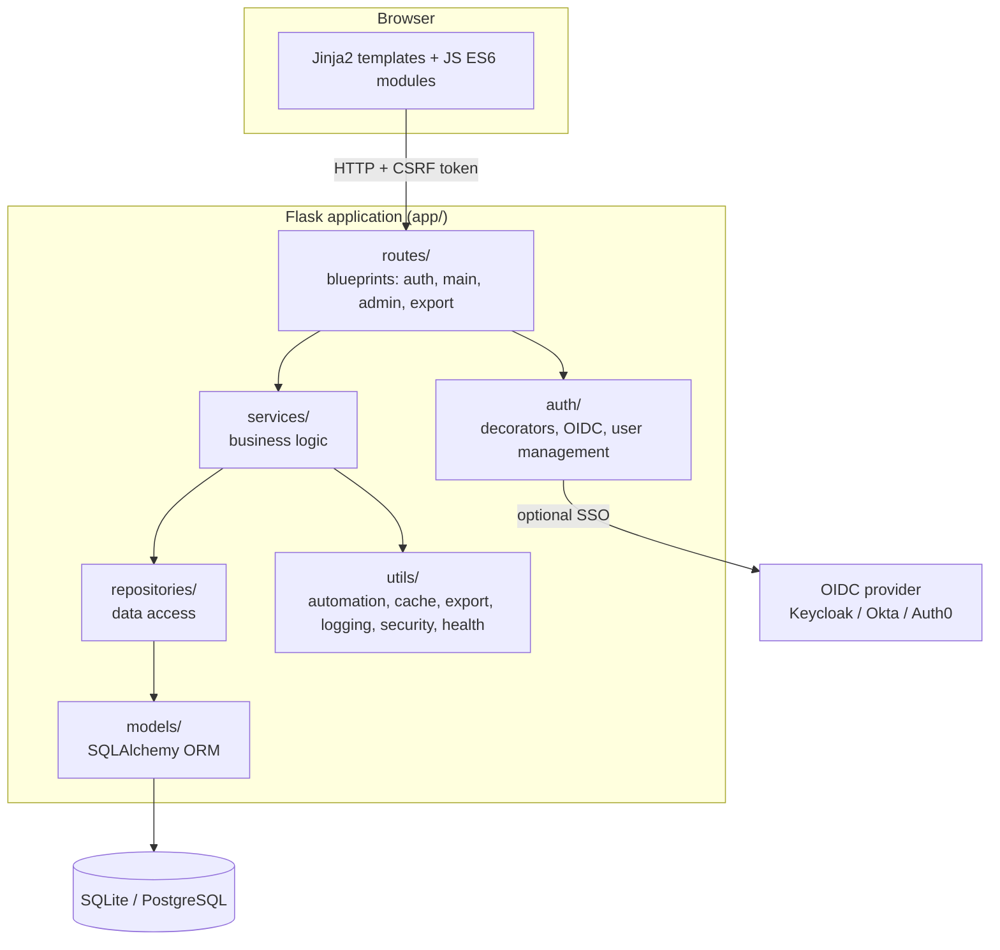
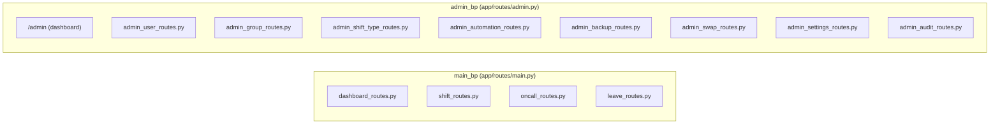

# Technical Architecture

> Fully rewritten in Phase 5 (2026-07) — the previous version
> described `app/models.py` as a flat file and
> `app/utils/decorators.py`/`helpers.py`/`ics_exporter.py`/`automation.py`
> directly at the root of `app/utils/`; both of these structures were
> replaced by packages starting in Phases 2-4 (see `report/Phase 2: Backend.md`
> and the root-level `CLAUDE.md` for the history).

## Overview

Kairos is a monolithic, layered Flask application:
routes → services → repositories → models, with Jinja2 templates
rendered server-side (no separate frontend/SPA).



### Why a services/repositories layer

Before Phase 2, all the logic (request parsing, business rules,
SQL queries) lived directly in `app/main.py` (1287 lines) and
`app/admin.py`. This was split into three distinct responsibilities:

- **`app/routes/`**: parses the HTTP request, calls a service, turns
  the result into a flash/redirect/JSON response. No SQL query or
  business rule here.
- **`app/services/`**: business logic (validations such as
  `can_add_shift`, side effects such as automatic shift rebalancing
  after a leave change). Calls the repositories, never Flask directly
  (no `request`/`flash`/`render_template`).
- **`app/repositories/`**: data access, pure SQLAlchemy queries.
  No business logic here (no `can_add_*`, no date computation).

Each blueprint (`main`, `admin`) is actually split across several
Python files that all register on the **same `Blueprint`
object** (defined in `main.py`/`admin.py`), to avoid breaking
existing `url_for()` references:



## Folder structure

```
app/
├── __init__.py           # create_app(): factory, extensions (db, login_manager,
│                          # limiter, csrf, conditional Talisman), blueprints
├── config/                # Active configuration: base.py, development.py,
│                          # production.py, testing.py
├── auth/                  # decorators.py (route guards), user_manager.py,
│                          # oidc_auth.py (SSO via Authlib)
├── models/                 # BaseModel + Group, User, ShiftType, Shift, OnCall,
│                          # Leave, AutomationConfig, NotificationLog, Setting,
│                          # SwapRequest, AppNotification, AuditLog
├── repositories/           # UserRepository, GroupRepository, ShiftRepository,
│                          # ShiftTypeRepository, OnCallRepository, LeaveRepository,
│                          # SwapRequestRepository, AppNotificationRepository,
│                          # AuditLogRepository (no dedicated repository for
│                          # Setting - Setting.get()/set() are methods on the
│                          # model itself)
├── services/               # UserService, GroupService, ShiftService,
│                          # ShiftTypeService, OnCallService, LeaveService,
│                          # ExportService, ScheduleService, AutomationAdminService,
│                          # SwapService, SettingsService (DB-backed admin
│                          # settings with env fallback, see ERD.md), AuditService
│                          # (single write point for the audit trail),
│                          # NotificationService (email reminders, called by
│                          # scripts/send_*_notifications.py, not by a route),
│                          # AppNotificationService (in-app bell, called by
│                          # SwapService on swap events),
│                          # BackupService (wraps scripts/backup_database.py
│                          # for /admin/backups)
├── routes/                 # auth.py, main.py + {dashboard,shift,oncall,leave,
│                          # swap,notification}_routes.py, admin.py +
│                          # admin_{user,group,shift_type,automation,backup,
│                          # swap,settings,audit}_routes.py, export.py
├── utils/
│   ├── automation/         # AdvancedShiftAutomation (single shift generation
│   │                      # engine), OnCallAutomation, status
│   ├── export/              # ICS generation (icalendar), zoneinfo (not pytz)
│   ├── helpers/             # common_helpers.py (can_add_shift/leave/oncall,
│   │                      # date formatting/parsing, Jinja filters
│   │                      # format_date/format_time/format_datetime),
│   │                      # timezone_helpers.py, js_translations.py
│   ├── logging/             # multi-handler logger: app.log, error.log,
│   │                      # debug.log, http_errors.log, audit.log (all
│   │                      # RotatingFileHandler) - no sql.log/auth.log/
│   │                      # syslog, contrary to an older version of
│   │                      # this doc. audit.log is fed by
│   │                      # AuditService.log() (see CLAUDE.md "Audit trail")
│   ├── notifications/       # email_sender.py (smtplib/email, stdlib) - called
│   │                      # by NotificationService, no associated route
│   ├── optimizations/       # eager_load (the only decorator left, Phase 4)
│   ├── security/            # (empty since Phase 4 — encryption.py and
│   │                      # token_manager.py removed, no real caller)
│   ├── health.py            # /health, /ready, /version endpoints (k8s probes)
│   └── prometheus_metrics.py # /metrics, gated by PROMETHEUS_ENABLED
├── static/
│   ├── css/                 # variables/base/utilities/components/layout/themes/pages
│   │                      # (Tailwind CSS 4 + daisyUI 5 via CDN, no build - see
│   │                      # below; these files only augment daisyUI
│   │                      # components, no local vendoring anymore)
│   └── js/                  # main.js (ES6 module entry point) + theme/utils/notifications
└── templates/                # Jinja2, macros/errors.html for error pages,
                              # emails/ for notification templates (HTML + text)
```

**Frontend** — Tailwind CSS 4 + daisyUI 5, loaded via `cdnjs.cloudflare.com`, zero
build step (Tailwind runs as `tailwindcss-browser`, the official JIT compiler that
scans classes directly in the browser - no `package.json`/npm in this project,
a deliberate choice). Bulma fully removed (PR #108, Tailwind/daisyUI overhaul):
no more vendor directory or download script, Font Awesome (7.2.0, SVG+JS mode -
cdnjs's `.woff2` files for this version are corrupted, rejected by Chromium's
font sanitizer) and FullCalendar (stayed on 6.1.21, loaded from `cdn.jsdelivr.net` -
the one exception to "everything via cdnjs", since cdnjs doesn't host its locale
files; version 7.0.0 was tested via three different CDNs and consistently raises
a real runtime error in FullCalendar's own compiled Preact rendering, not a
hosting issue) are also 100% CDN.
`app/static/css/variables.css` bridges daisyUI's `--color-*` variables to
stable application-level names (`--app-color-primary`, `--bg-primary`...) used
by the small amount of remaining custom CSS.

**Visual identity** (PR #110): official Dracula palette (dark theme) / Alucard
(light theme), overridden in `app/static/css/theme-colors.css` on every daisyUI
semantic color (`--color-primary/-secondary/-accent/-neutral/-info/-success/-warning/-error`
and the three surface levels `base-100/200/300`) - values 100% sourced from
draculatheme.com/spec, no invented hues. The only possible method under
`tailwindcss-browser` (the JIT compiler doesn't support
`@plugin "daisyui/theme"`/`@theme`, verified in a real browser). Mobile
navigation uses a native daisyUI `drawer`, the shift-creation modal (generated
in JS in `fullcalendar-config.js`) uses a native `<dialog>` rather than a
`.modal-open` class toggle.

`scripts/` (outside `app/`) contains standalone cron entry points -
`send_shift_notifications.py`/`send_oncall_notifications.py` +
`notification_config.py` (SMTP config via environment variables) -
following the same pattern as `backup_database.py`/`backup_config.py`
(local/S3 backup, independent of `app/` by design - disaster
recovery). No scheduler built into the Flask application (no
APScheduler): these scripts are triggered by an external cron job
(see `scripts/cron_example.sh`), or, in Docker, by `crond` started by
`docker/entrypoint.sh` in the same container (`NOTIFICATIONS_ENABLED`/
`BACKUP_ENABLED`, schedule in `docker/crontabs/appuser`).
`BackupService` (`app/services/`) is the sole exception in the
opposite direction - it imports `scripts/backup_config.py`/`backup_database.py`
for the admin UI, without breaking the isolation guarantee since
`scripts/` never imports `app/`.

## Data models

See [`ERD.md`](ERD.md) for the complete entity-relationship diagram.

Summary: `Group` 1:N `User` 1:N `Shift`/`OnCall`/`Leave` (each 1:N
from `User`), `ShiftType` 1:N `Shift`. `AutomationConfig` is a
standalone table (JSON key/value) with no relationship, used to persist
the on-call rotation order. `NotificationLog` (user_id, notification_type,
period_start, unique constraint on all three) records already-sent
email reminders, to prevent a duplicate send if a cron script is
rerun for the same period. `Setting` is the same kind of key/value
store as `AutomationConfig`, but for admin settings editable at
runtime (`/admin/settings`). `SwapRequest` carries 3 FKs to `User`
(requester/target_user/reviewer) and 2 to `Shift` (shift/target_shift).
`AppNotification` (in-app bell) and `AuditLog` (change history,
`/admin/audit-log`) are both 1:N from `User` but
must not be confused with each other or with `NotificationLog` — see
CLAUDE.md ("In-app notifications", "Audit trail") for the distinction.

## Authentication

Two modes, controlled by `OIDCConfig` (`config_oidc.py`):

1. **Basic** (default): email/password via Flask-Login,
   `/login` form.
2. **OIDC/SSO** (optional): if `OIDC_ENABLED=true`, redirect to the
   configured provider. If `OIDC_DISABLE_BASIC_AUTH=true` is also set, the
   classic form is disabled and `/login` redirects directly
   to `/oidc/login`.

See [`SEQUENCE_DIAGRAMS.md`](SEQUENCE_DIAGRAMS.md) for the detail of
both flows.

## Security

- **CSRF**: `Flask-WTF` `CSRFProtect` active across the entire
  application (added in Phase 4 — previously absent despite the
  dependency being present). HTML forms embed a hidden
  `csrf_token` field, JS `fetch()` calls send the
  `X-CSRFToken` header (read from a `<meta name="csrf-token">` tag in
  `base.html`).
- **Talisman**: HTTP security headers (X-Content-Type-Options,
  X-Frame-Options, etc.), enabled only when `TALISMAN_FORCE_HTTPS=true`
  (see `app/config/`).
- **Passwords**: hashed via Werkzeug (`generate_password_hash`),
  never stored in plain text, never serialized (`User.to_dict()` explicitly
  excludes `password_hash` and `ics_token`).
- **ICS export**: accessible either via an authenticated session or via
  a bearer token (`ics_token`, `secrets.token_urlsafe(32)`) passed as a
  URL parameter — see [`api/API.md`](../api/API.md).

## Database

SQLite by default (`instance/app.db` file), PostgreSQL supported in
production (see [`deployment/DEPLOYMENT_ADVANCED.md`](../deployment/DEPLOYMENT_ADVANCED.md)).
Composite indexes exist on `Shift(user_id, date)`,
`Shift(date, start_time)`, `OnCall(user_id, start_time, end_time)`,
`Leave(user_id, start_date, end_date)` — preserve these if you touch
query patterns.

## Tests

See `tests/` (`unit/`, `integration/`, `e2e/`, `fixtures/`) and
`report/Phase 4: TEST IMPROVEMENT.md` for the structure and
coverage history (81% as of Phase 5).
