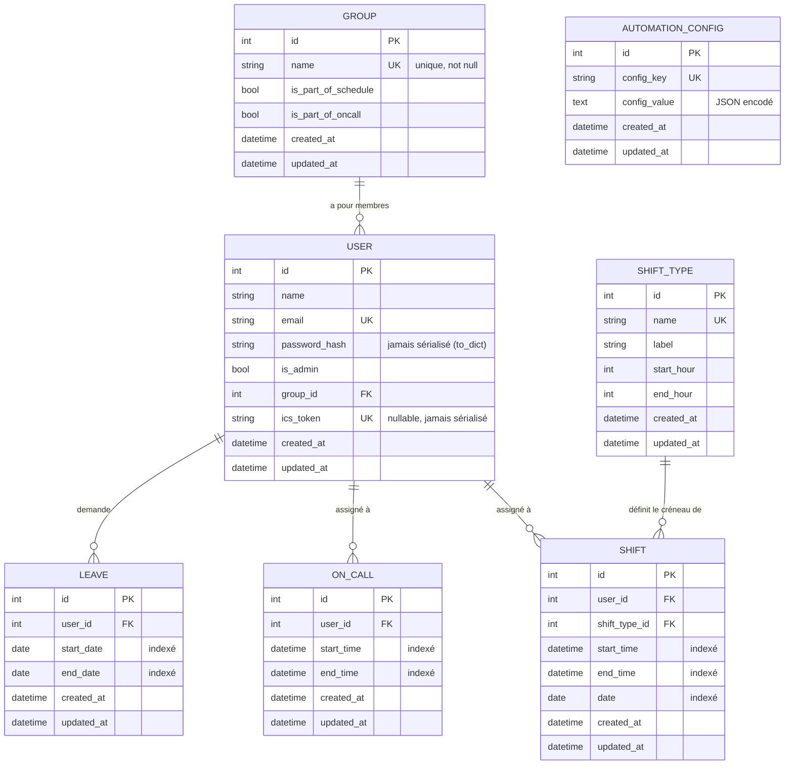

# Schéma entité-relation (ERD)

Généré à partir de `app/models/*.py` (Phase 5, 2026-07) — les champs
`id`, `created_at`, `updated_at` sont hérités de `BaseModel`
(`app/models/base.py`) et communs à toutes les tables ci-dessous.

## Notes

- **`AutomationConfig`** n'a aucune relation avec les autres tables :
  c'est un stockage clé/valeur générique (utilisé pour persister l'ordre
  de rotation des astreintes entre redémarrages). Absent de toute
  documentation précédente malgré son usage réel dans
  `app/utils/automation/`.
- **`Leave` n'a pas de champ `reason`** — l'ancienne documentation API
  décrivait un champ `reason: string` sur les congés qui n'a jamais
  existé dans le modèle.
- **Index composites** (au-delà des index simples listés ci-dessus,
  définis dans les classes de modèle) :
  - `Shift(user_id, date)` et `Shift(date, start_time)`
  - `OnCall(user_id, start_time, end_time)`
  - `Leave(user_id, start_date, end_date)`

  Préservez ces index si vous modifiez les patterns de requête dans
  `app/repositories/`.
- **Suppression en cascade** : `Group.users`, `User.shifts`,
  `User.on_calls` et `User.leaves` sont tous déclarés
  `cascade="all, delete-orphan"` — supprimer un groupe supprime ses
  utilisateurs, supprimer un utilisateur supprime tous ses shifts/
  astreintes/congés.
