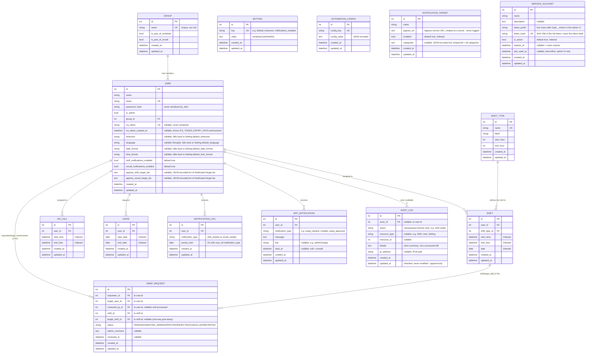

# Entity-Relationship Diagram (ERD)

Generated from `app/models/*.py` — the `id`, `created_at`, `updated_at`
fields are inherited from `BaseModel` (`app/models/base.py`) and common
to all tables below.

## Notes

- **`NotificationTarget`** and **`ServiceAccount`** have no FK
  relationship to any other table. `NotificationTarget` rows are picked
  by id in `User.apprise_shift_target_ids`/`apprise_oncall_target_ids`
  (a JSON-encoded list of ids on `User`, not a real foreign key —
  deleting a target silently drops it from any user's list on next
  read rather than cascading). `ServiceAccount` is a standalone bearer
  credential for the public `/api/v1/*` API, unrelated to `User`/
  Flask-Login sessions entirely.
- **`AutomationConfig`** has no relationship to the other tables:
  it's a generic key/value store (used to persist the on-call
  rotation order across restarts). Absent from any previous
  documentation despite its real use in
  `app/utils/automation/`.
- **`Leave` has no `reason` field** — the old API documentation
  described a `reason: string` field on leaves that never
  existed in the model.
- **`NotificationLog`**: unique constraint on
  `(user_id, notification_type, period_start)` - prevents a duplicate
  send if a notification script (`scripts/send_*_notifications.py`)
  is rerun for an already-processed period.
- **Composite indexes** (beyond the simple indexes listed above,
  defined in the model classes):
  - `Shift(user_id, date)` and `Shift(date, start_time)`
  - `OnCall(user_id, start_time, end_time)`
  - `Leave(user_id, start_date, end_date)`

  Preserve these indexes if you modify the query patterns in
  `app/repositories/`.
- **Cascade delete**: `Group.users`, `User.shifts`,
  `User.on_calls` and `User.leaves` are all declared
  `cascade="all, delete-orphan"` — deleting a group deletes its
  users, deleting a user deletes all their shifts/
  on-calls/leaves.
- **`Setting`**: generic key/value store (same shape as `AutomationConfig`)
  for admin settings editable at runtime from `/admin/settings`
  (timezone, language, date/time formats, public URL,
  pagination, notifications, backup/audit retention, ICS
  token expiry) — a present row always wins; its absence falls
  straight back to the corresponding environment variable/default value
  (`SettingsService`).
- **`SwapRequest`**: the first model in the project with several FKs to
  the same table (`requester_id`/`target_user_id`/`reviewed_by_id` → `User`).
  Deliberately **without** `db.relationship()` (a typing limitation of
  SQLAlchemy 2.0's stubs on relationships not configured with the
  dedicated mypy plugin) — `requester`/`target_user`/`reviewer`/`shift`/`target_shift`
  are plain `@property` lookups via `db.session.get(...)`.
- **`AppNotification`**: the in-app notification bell (unread badge
  in the sidebar) — **not to be confused** with `NotificationLog`
  (anti-duplicate guard for weekly emails, never displayed) nor
  with `AuditLog` below.
- **`AuditLog`**: append-only, never modified after creation
  (`updated_at` inherited from `BaseModel` but always equal to `created_at`
  in practice). `actor_id` nullable (no action in this project is
  currently attributed to a system/unauthenticated caller, but the
  column stays nullable as a cautious default). Composite index on
  `(resource_type, resource_id)` in addition to the simple indexes on
  `actor_id`/`action`. Single write point: `AuditService.log()` — never
  insert directly via the repository from a route/service.
