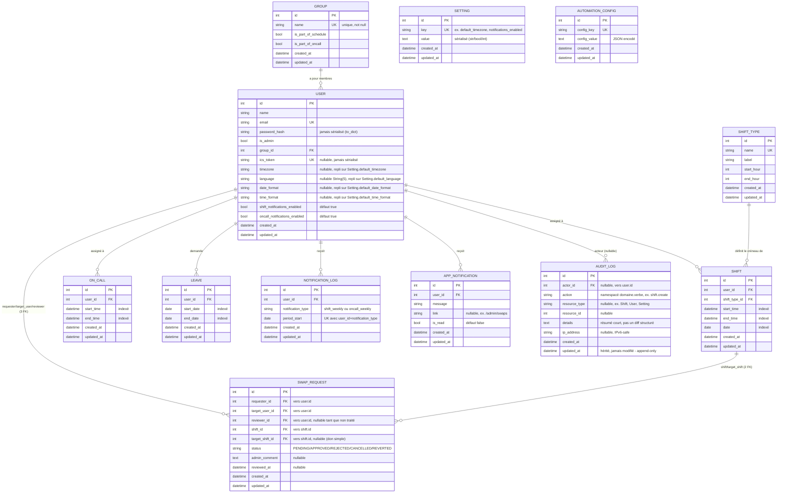

# Schéma entité-relation (ERD)

Généré à partir de `app/models/*.py` (Phase 5, 2026-07, complété 2026-07-16
avec `Setting`/`SwapRequest`/`AppNotification`/`AuditLog` — voir CLAUDE.md
"Shift swaps"/"In-app notifications"/"Audit trail" pour le détail
fonctionnel de chacun) — les champs `id`, `created_at`, `updated_at` sont
hérités de `BaseModel` (`app/models/base.py`) et communs à toutes les
tables ci-dessous.

## Notes

- **`AutomationConfig`** n'a aucune relation avec les autres tables :
  c'est un stockage clé/valeur générique (utilisé pour persister l'ordre
  de rotation des astreintes entre redémarrages). Absent de toute
  documentation précédente malgré son usage réel dans
  `app/utils/automation/`.
- **`Leave` n'a pas de champ `reason`** — l'ancienne documentation API
  décrivait un champ `reason: string` sur les congés qui n'a jamais
  existé dans le modèle.
- **`NotificationLog`** : contrainte unique sur
  `(user_id, notification_type, period_start)` - empêche un double
  envoi si un script de notification (`scripts/send_*_notifications.py`)
  est relancé pour une période déjà traitée.
- **Index composites** (au-delà des index simples listés ci-dessus,
  définis dans les classes de modèle) :
  - `Shift(user_id, date)` et `Shift(date, start_time)`
  - `OnCall(user_id, start_time, end_time)`
  - `Leave(user_id, start_date, end_date)`

  Préservez ces index si vous modifiez les patterns de requête dans
  `app/repositories/`.
- **Suppression en cascade** : `Group.users`, `User.shifts`,
  `User.on_calls` et `User.leaves` sont tous déclarés
  `cascade="all, delete-orphan"` — supprimer un groupe supprime ses
  utilisateurs, supprimer un utilisateur supprime tous ses shifts/
  astreintes/congés.
- **`Setting`** : store clé/valeur générique (même forme qu'`AutomationConfig`)
  pour les réglages admin éditables à chaud depuis `/admin/settings`
  (fuseau horaire, langue, formats de date/heure, URL publique,
  pagination, notifications, rétention sauvegardes/audit, expiration
  token ICS) — une ligne présente l'emporte toujours ; son absence fait
  retomber en direct sur la variable d'environnement/valeur par défaut
  correspondante (`SettingsService`, voir CLAUDE.md "Configuration:
  two parallel systems").
- **`SwapRequest`** : le premier modèle du projet avec plusieurs FK vers
  la même table (`requester_id`/`target_user_id`/`reviewer_id` → `User`).
  Délibérément **sans** `db.relationship()` (limite de typage des stubs
  SQLAlchemy 2.0 sur les relations non configurées avec le plugin mypy
  dédié) — `requester`/`target_user`/`reviewer`/`shift`/`target_shift`
  sont de simples `@property` via `db.session.get(...)`.
- **`AppNotification`** : la cloche de notification in-app (badge non-lu
  dans la sidebar) — **à ne pas confondre** avec `NotificationLog`
  (garde-fou anti-doublon des emails hebdomadaires, jamais affiché) ni
  avec `AuditLog` ci-dessous.
- **`AuditLog`** : append-only, jamais modifié après création
  (`updated_at` hérité de `BaseModel` mais toujours égal à `created_at`
  en pratique). `actor_id` nullable (aucune action de ce projet n'est
  aujourd'hui attribuée à un appelant système/non-authentifié, mais la
  colonne reste nullable par défaut prudent). Index composite sur
  `(resource_type, resource_id)` en plus des index simples sur
  `actor_id`/`action`. Seul point d'écriture : `AuditService.log()` — ne
  jamais insérer directement via le repository depuis une route/un
  service.
