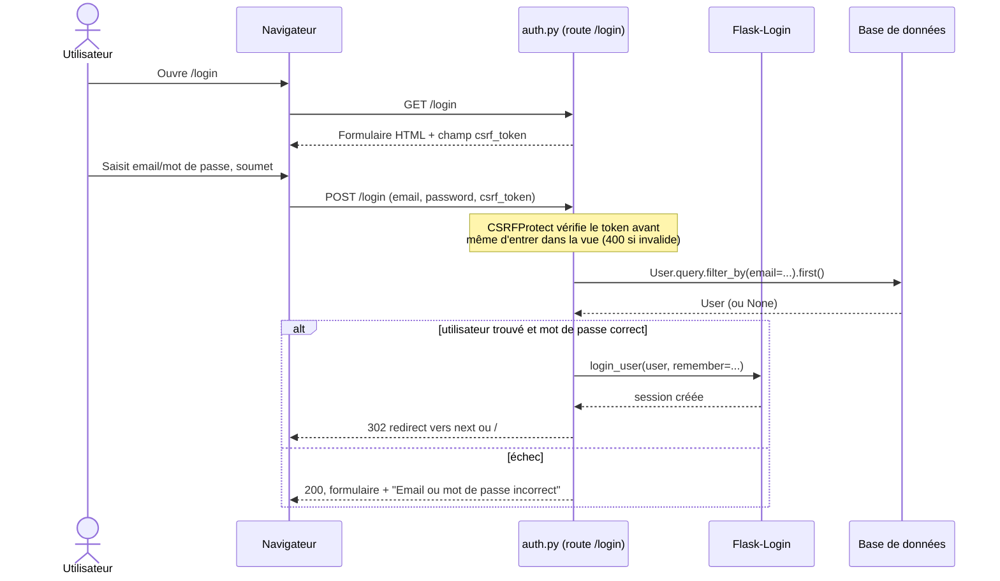
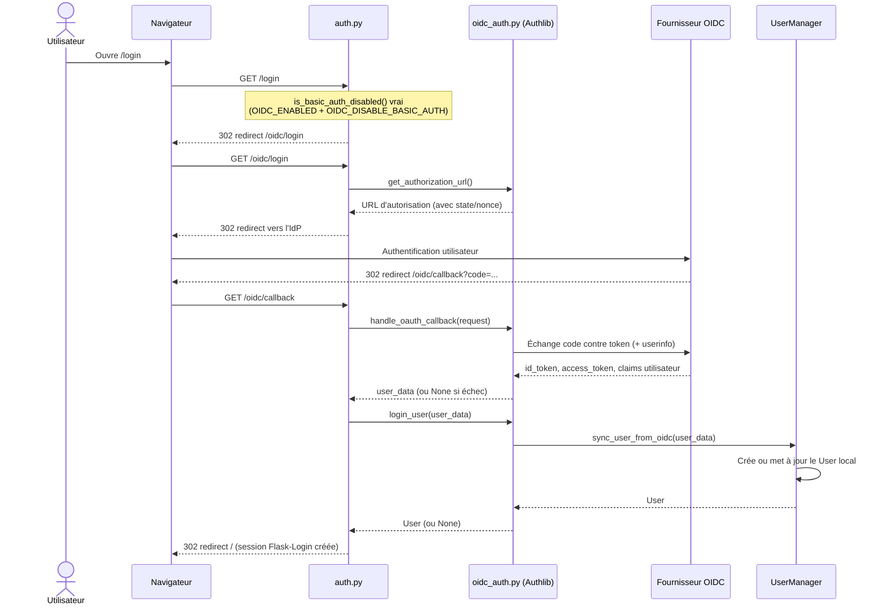
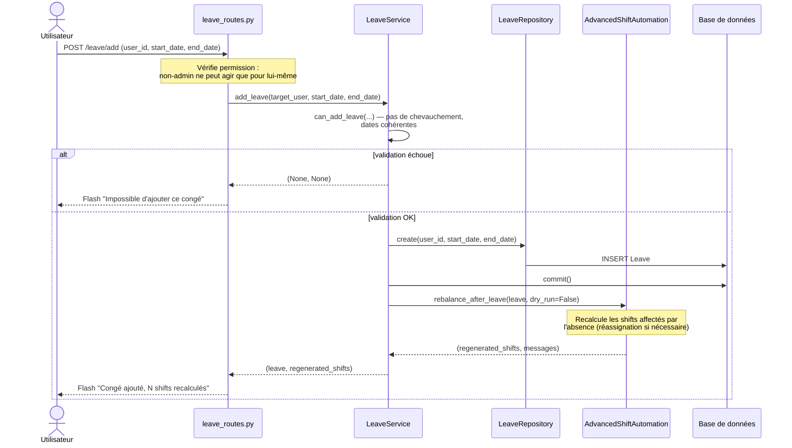
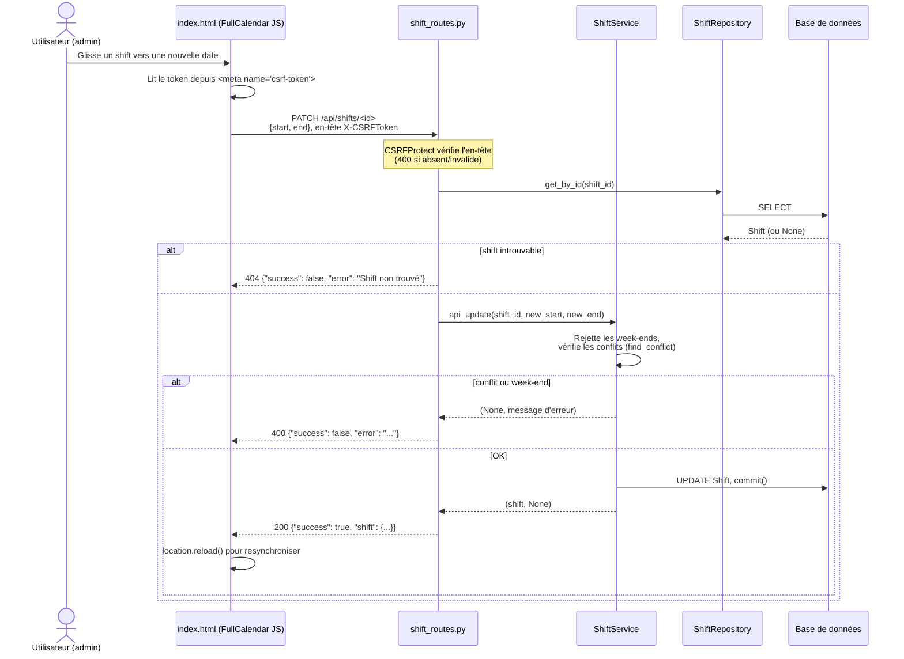
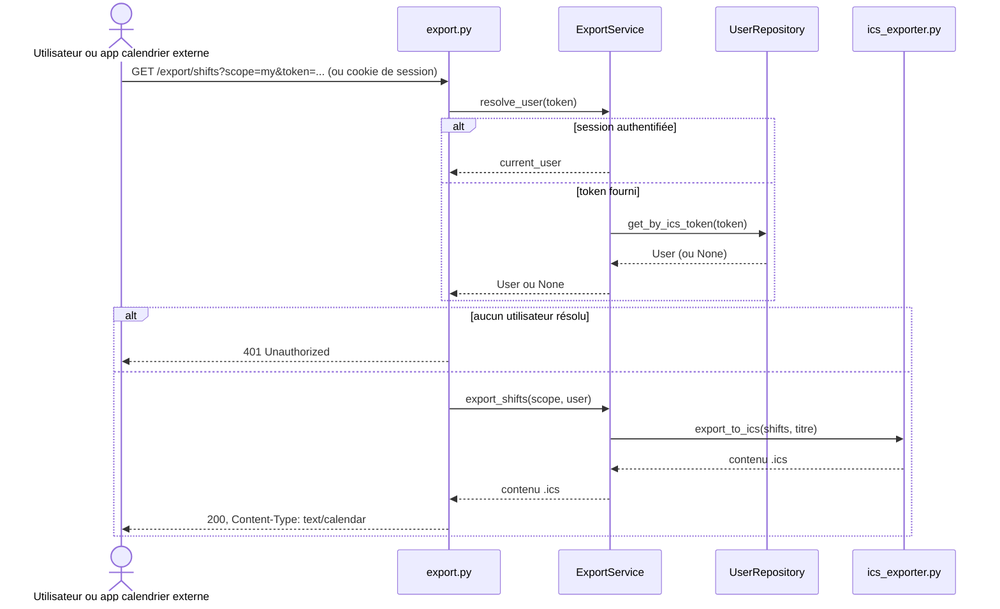

# Diagrammes de séquence

Flux utilisateur clés, tracés à partir du code réel (`app/routes/`,
`app/services/`, `app/auth/`) — Phase 5, 2026-07.

## Connexion basique (email/mot de passe)

## Connexion OIDC/SSO

## Ajout de congé avec rééquilibrage automatique des shifts

## Mise à jour d'un shift par glisser-déposer (API JSON + CSRF)

## Export ICS (session ou token porteur)

