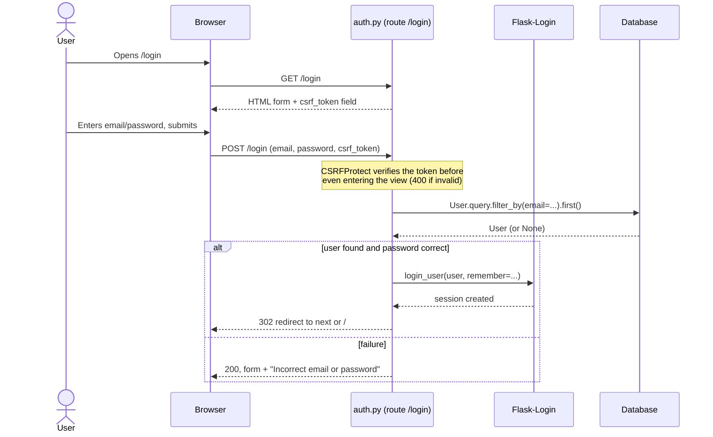
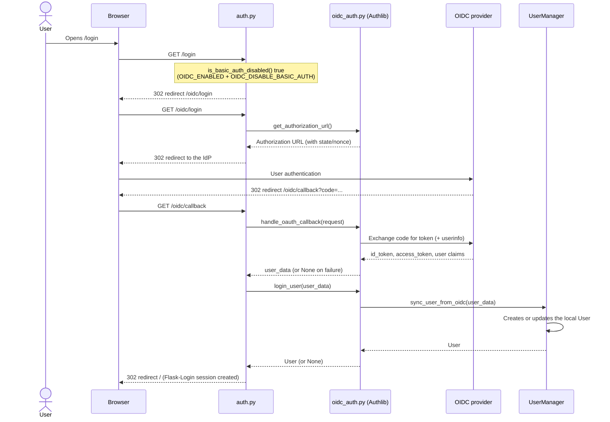
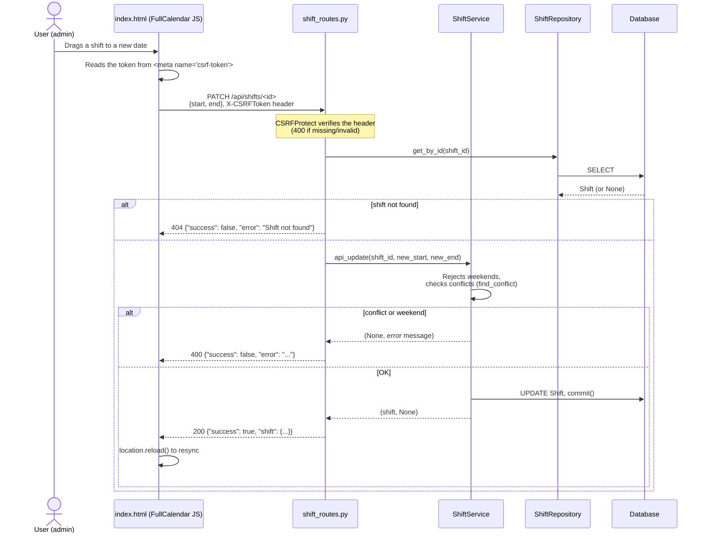
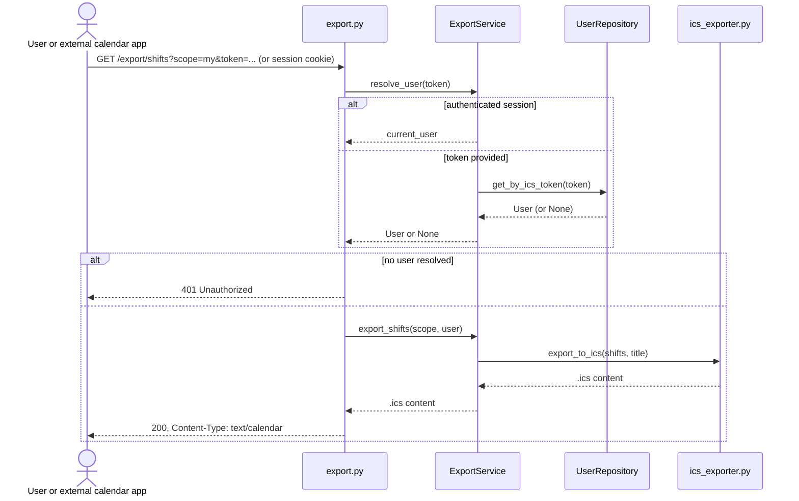

# Sequence Diagrams

Key user flows, traced from the actual code (`app/routes/`,
`app/services/`, `app/auth/`).

## Basic login (email/password)

## OIDC/SSO login

## Adding leave with automatic shift rebalancing

## Updating a shift via drag-and-drop (JSON API + CSRF)

## ICS export (session or bearer token)

