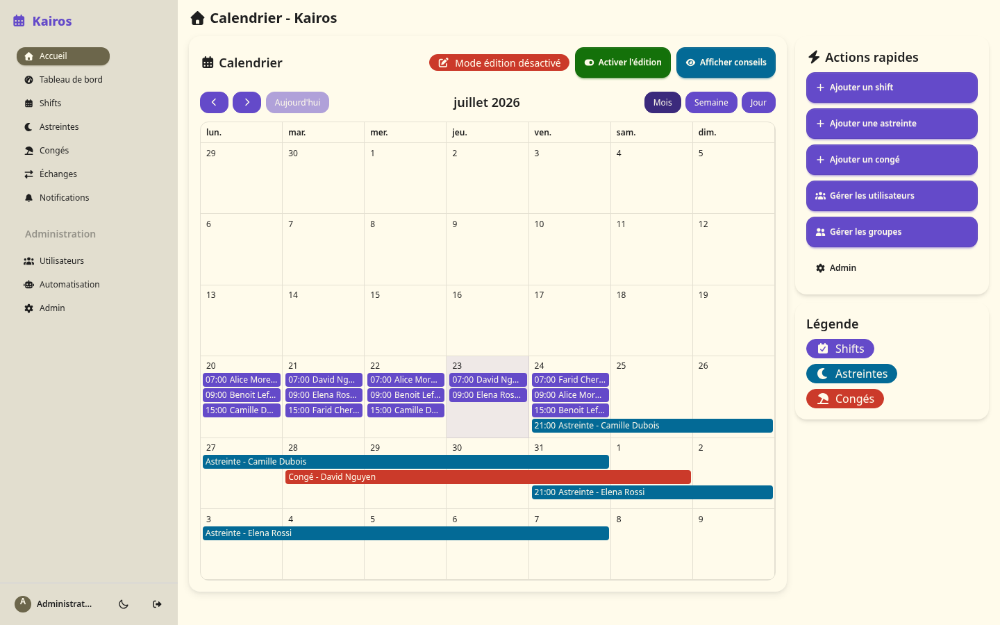
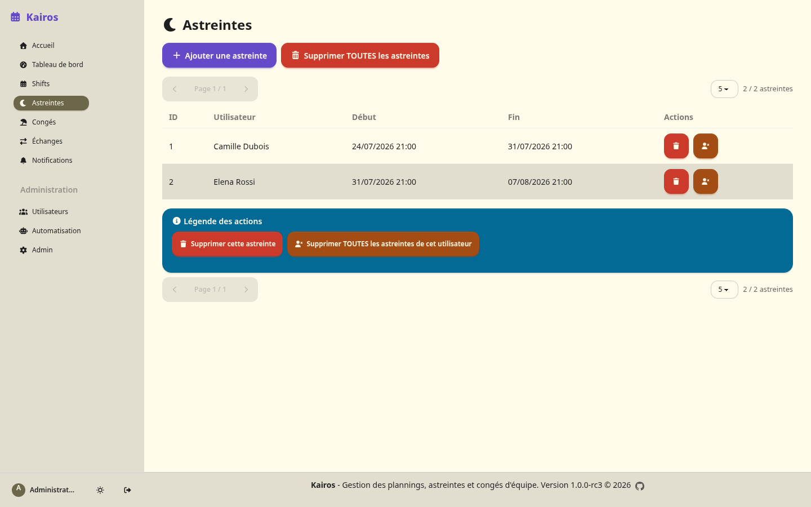
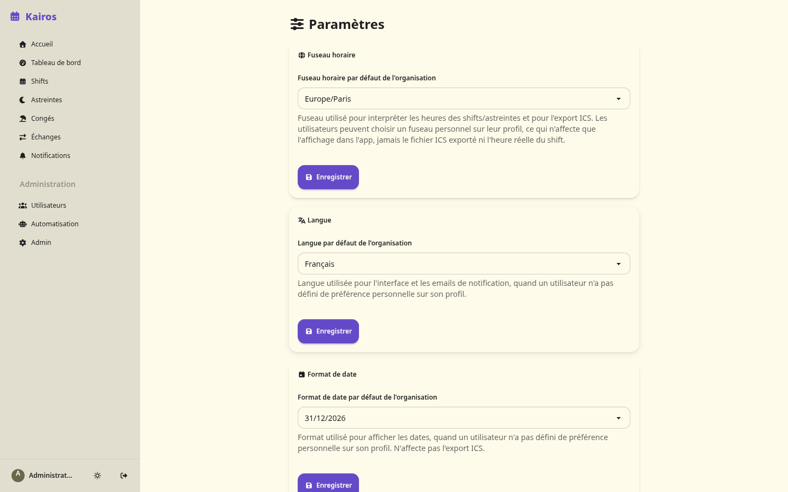

# Kairos

[](https://github.com/FoxOps/kairos/actions/workflows/tests.yml)
[](LICENSE)
[](https://www.python.org/)
[](ROADMAP.md)

Team shift scheduling, on-call rotations, and leave management - with ICS
calendar export, SSO/OIDC, a public REST API, and a rotation engine that
actually understands legal rest constraints.

<p align="center">
  <picture>
    <source media="(prefers-color-scheme: dark)" srcset="Docs/assets/screenshots/calendar-dark.png">
    <source media="(prefers-color-scheme: light)" srcset="Docs/assets/screenshots/calendar-light.png">
    
  </picture>
</p>

<details>
<summary>More screenshots (on-call list, admin settings)</summary>
<br>

<p align="center">
  <picture>
    <source media="(prefers-color-scheme: dark)" srcset="Docs/assets/screenshots/oncall-dark.png">
    <source media="(prefers-color-scheme: light)" srcset="Docs/assets/screenshots/oncall-light.png">
    
  </picture>
</p>

<p align="center">
  <picture>
    <source media="(prefers-color-scheme: dark)" srcset="Docs/assets/screenshots/admin-settings-dark.png">
    <source media="(prefers-color-scheme: light)" srcset="Docs/assets/screenshots/admin-settings-light.png">
    
  </picture>
</p>

</details>

## Quick start (Docker)

No need to clone the repo - two files are enough:

```bash
mkdir kairos && cd kairos
curl -o docker-compose.yml https://raw.githubusercontent.com/FoxOps/kairos/main/docker/docker-compose.example.yml
curl -o .env https://raw.githubusercontent.com/FoxOps/kairos/main/docker/.env.example

nano .env  # set SECRET_KEY and DEFAULT_ADMIN_PASSWORD at minimum

docker compose up -d
```

Open **http://localhost:5000**, log in with `admin@kairos.local` /
`admin123` (or whatever you set in `.env`) - you'll be required to set a
new, stronger password before you can do anything else.

Full install options (bare-metal, PostgreSQL/MySQL, Kubernetes, reverse
proxy): [Docs/deployment/](Docs/deployment/). First five minutes as a new
user or admin: [Docs/guides/QUICK_START.md](Docs/guides/QUICK_START.md).

## What it does

- Shift scheduling with day/week/month views, drag & drop, and configurable
  shift types
- On-call rotations, generated automatically while respecting a legal
  minimum rest period between two on-call weeks - if nothing can be
  generated without violating it, it leaves the slot unfilled and notifies
  admins rather than silently breaking the rule
- Leave management, integrated into the same schedule view
- Shift swaps between users - three-party workflow (requester → target
  confirms → admin approves), not just a two-click reassignment
- Multi-language (French/English) and multi-timezone, per-user or
  organization-wide
- ICS export for Google Calendar/Outlook/etc., email reminders, in-app and
  external (Slack/Discord/Telegram/webhook) notifications
- SSO/OIDC (Keycloak, Okta, Auth0-compatible) alongside regular login
- An audit trail of who changed what, and a public read-only REST API
  (`/api/v1`) with its own service-account tokens, separate from the
  session-based UI

Full feature list and architecture: [Docs/](Docs/).

## Why Kairos?

In Ancient Greek, there were two words for time. Chronos (Χρόνος) is
chronological time, the steady, measurable ticking of the clock. It's the
kind of time you set a schedule by. Kairos (Καιρός) means something else
entirely: the right moment, the instant when something needs to happen
right now.

That's the tension every on-call team lives in, really. Your schedule is
chronos, predictable, rotating, planned weeks ahead. But an incident
doesn't check your calendar first. It happens at 3 AM on a Sunday, and
what matters isn't the schedule itself. It's making sure the right person
gets reached at the right moment, every time.

Kairos handles the chronos part, the rotations, the shifts, the calendar
logic, so your team can focus on what actually matters: being there,
ready, exactly when it counts.

## Built with AI - honestly

Kairos was built almost entirely with AI coding tools, by someone whose
day job is sysadmin work, not software engineering. It started as a way
to fill a real, unmet need: an on-call/scheduling tool for a team that
couldn't justify a PagerDuty-class budget, and couldn't get dedicated dev
time to build something in-house either.

This wasn't a weekend vibe-coding experiment. The AI was deliberately
pushed to document every decision, comment its reasoning, and write real
tests - the assumption from early on was that human developers might pick
up where it left off, and the codebase needed to be legible to them, not
just functional. `CLAUDE.md` at the root of this repo is that accumulated
context: a long-running design log of what was tried, what broke, and
why things are the way they are - written for whoever (human or AI) works
on this next.

That said, this is offered with open eyes, not a sales pitch. AI is a
genuinely useful tool for turning an idea into working software fast,
especially for someone who can script but can't "code to save their
life." It is also not a substitute for the judgment a human engineer
brings to legal nuance, organizational complexity, or the kind of
long-term architectural tradeoffs that don't have a clean right answer.
No human has audited every line of this codebase. If that matters to
you before you rely on it, review it first - the code is right here.
Contributions, code review, and blunt criticism from actual developers
are genuinely welcome, not just tolerated.

## Documentation

- [Docs/](Docs/) - full index: user guide, admin guide, architecture, API
  reference, deployment, environment variables
- [ROADMAP.md](ROADMAP.md) - version history and what's planned next
- [CLAUDE.md](CLAUDE.md) - the design/decision log mentioned above

## Tech stack & licenses

Flask + SQLAlchemy on the backend, server-rendered Jinja2 + Tailwind/daisyUI
on the frontend (no build step, no Node toolchain - see
[Docs/architecture/ARCHITECTURE.md](Docs/architecture/ARCHITECTURE.md)).
SQLite by default, PostgreSQL and MySQL/MariaDB also supported.

Every third-party library this project depends on, with its license and a
link to its source, is listed in
[THIRD_PARTY_NOTICES.md](THIRD_PARTY_NOTICES.md).

## Contributing

Issues, discussions, and pull requests are welcome - see
[Docs/README.md](Docs/README.md#contributing-to-the-documentation) for the
docs contribution workflow, or just fork, branch, and open a PR for code.

## License

Kairos is licensed under **[CeCILL v2.1](LICENSE)**, a French free-software
license GPL-compatible in spirit (copyleft, source access, same
redistribution terms).

> **Provided "as is"**, without warranty of any kind, express or implied,
> including but not limited to warranties of merchantability, fitness for
> a particular purpose, and non-infringement. Use it at your own risk -
> see the [LICENSE](LICENSE) file for the full terms.

## Contact

Questions, bugs, or ideas: open an [Issue](https://github.com/FoxOps/kairos/issues)
or a [Discussion](https://github.com/FoxOps/kairos/discussions) on GitHub.

---

**Version**: 1.0.0-rc3 © 2026
